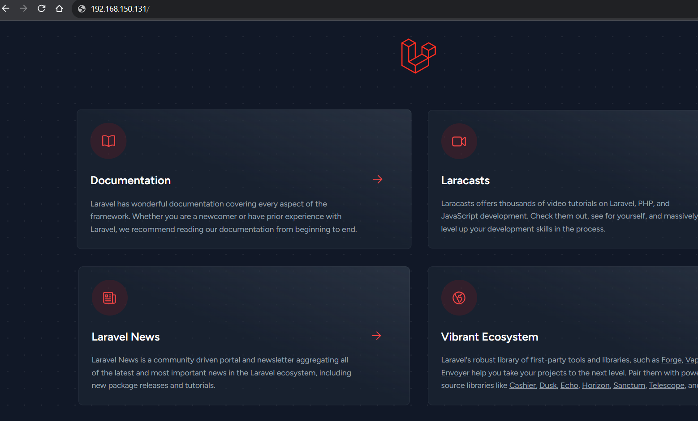
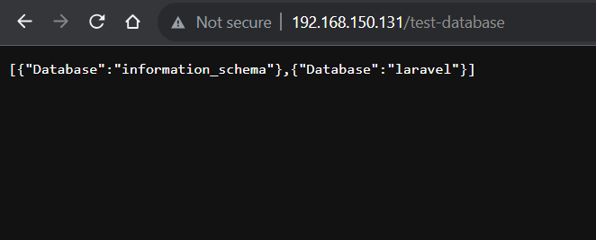

I have chosen a sample app provided by Laravel. I will setup that application in Docker and run it.  
Source: https://github.com/laravel/laravel.git

[laravel-app](./laravel-app) contains the source code of the application.

MySQL and Nginx are also needed. I will run those also on docker.  
All 3 Laravel app, MySql and Nginx are needed to run the whole application.  
To define and configure multi-container Docker applications, docker-composer file is the best option.

[docker-compose.yml](docker-compose.yml) file contains configurations for 3 containers: webserver(Nginx server), db(Mysql) and app(laravel app).  
The 'app' containers use the image built using the [Dockerfile](Dockerfile).

The folders [mysql](mysql), [nginx](nginx) & [php](php) contain the default configurations to run each corresponding container.

I edited the environment variables value for the database in  [.env](.env) file provided by Laravel source code.
```env
DB_CONNECTION=mysql
DB_HOST=db #name of MySQL docker container
DB_PORT=3306
DB_DATABASE=laravel
DB_USERNAME=sudip
DB_PASSWORD=mypassword
```

To start the application:  
`docker-compose build app` to build the app container image & `docker-compose up` to start the application.  
OR  `docker-compose up` also does the same. 

In Laravel application, we need to run `composer install` command to get the dependencies for the application.  
Run `docker-compose exec app composer install` for that.

**Check Application**  
Check the application by providing your ip address in the browser.


**Check Database Connections**  
I have added a code in [laravel-app/routes/web.php](laravel-app/routes/web.php) that shows the name of database.

